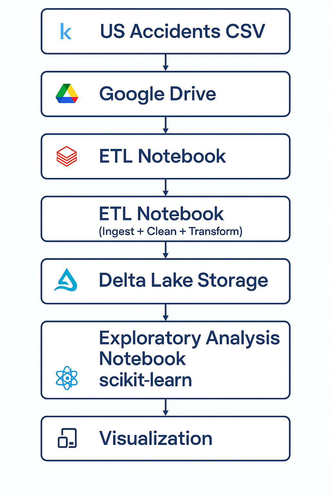

# 🚦 US Accidents ELT + ML Project (Databricks | Delta Lake | scikit-learn)

This project implements an end-to-end **ELT (Extract–Load–Transform)** pipeline on the **US Accidents** dataset using **Databricks**, **Delta Lake**, and **scikit-learn**.  
It was developed as part of the **MADSC102 – Unlocking the Power of Big Data** course.

The pipeline covers:

- Ingestion of a large CSV dataset into Databricks
- Storage in **Delta Lake**
- Cleaning & transformation with **PySpark**
- Exploratory analytics using SQL & notebooks
- A lightweight ML model using **scikit-learn**
- A final **Visualization layer** for insights

---

## 🧠 Overview

The goal of this project is to demonstrate how to build a **cloud-style data engineering workflow** using Databricks Community Edition:

- **Extract** US Accidents CSV from Kaggle via **Google Drive + `wget`**
- **Load** into Databricks FileStore (**DBFS**)
- **Transform** using PySpark and persist as **Delta tables**
- **Analyze** data with SQL + notebooks
- **Model** accident severity with a scikit-learn classifier
- **Orchestrate** execution via a simple “job trigger” notebook
- **Visualize** aggregated outputs

Because Databricks CE / Serverless has strict limits on Spark ML model size, the ML part is implemented with **pandas + scikit-learn**, which runs reliably in this environment.

---

## 🏗 Architecture

The high-level architecture is:

- Kaggle CSV → Google Drive → Databricks DBFS  
- PySpark ETL → Delta Lake  
- EDA Notebook + ML Notebook → Visualization Layer

```
                         ┌──────────────────────────┐
                         │      Kaggle Dataset       │
                         │   (US Accidents CSV)      │
                         └─────────────┬────────────┘
                                       │
                                       ▼
                         ┌──────────────────────────┐
                         │   Google Drive Storage    │
                         │  (Public Download Link)   │
                         └─────────────┬────────────┘
                                       │ wget
                                       ▼
                      ┌──────────────────────────────────┐
                      │       Databricks FileStore (DBFS) │
                      │   /FileStore/tables/us_accidents  │
                      └──────────────────┬────────────────┘
                                         │ spark.read.csv()
                                         ▼
                     ┌─────────────────────────────────────┐
                     │     ETL Notebook (01_ingest_...)    │
                     │   - Extract CSV                      │
                     │   - Clean + Transform                │
                     │   - Feature Engineering              │
                     └──────────────────┬───────────────────┘
                                        │ write.format("delta")
                                        ▼
                   ┌────────────────────────────────────────┐
                   │           Delta Lake Storage            │
                   │   dbfs:/mnt/delta/us_accidents_clean   │
                   └───────────────┬────────────────────────┘
                                   │ spark.sql() + SQL views
                                   ▼
          ┌────────────────────────────────────────────────────────┐
          │         Exploratory Analysis Notebook (02_eda)          │
          │  - State trends                                          │
          │  - Hourly accident patterns                              │
          │  - Weather correlations                                  │
          │  - Summary tables for Power BI                           │
          └──────────────────────────┬──────────────────────────────┘
                                     │ export tables as CSV
                                     ▼
                  ┌──────────────────────────────────────────┐
                  │              Power BI Desktop             │
                  │   - Hotspot analysis                     │
                  │   - Severity dashboards                  │
                  │   - Trend analysis                       │
                  └──────────────────────────────────────────┘


                     MACHINE LEARNING PIPELINE (PARALLEL)
                     -------------------------------------

                                        ▲
                                        │ spark.table()
                   ┌────────────────────┴──────────────────────┐
                   │            ML Notebook (03_ml)            │
                   │   - Convert sample to pandas              │
                   │   - scikit-learn Logistic Regression      │
                   │   - Predict severity                      │
                   │   - Accuracy + classification report      │
                   └────────────────────┬──────────────────────┘
                                        │ %run automation
                                        ▼
                  ┌──────────────────────────────────────────┐
                  │       Simulated ML Job Trigger (04_job)   │
                  │   Orchestrates ML pipeline steps           │
                  └──────────────────────────────────────────┘

```


---

## 📦 Tools & Technologies

| Category        | Tools / Services                                      |
|----------------|--------------------------------------------------------|
| Platform       | Databricks Community Edition / Databricks Workspace   |
| Storage        | DBFS (FileStore), Delta Lake                          |
| Processing     | PySpark, SQL, Pandas                                  |
| Machine Learning | scikit-learn (Logistic Regression)                  |
| Orchestration  | Databricks notebook `%run` trigger                    |
| Visualization  | Any BI / plotting tool (e.g. matplotlib, Power BI, etc.) |
| Data Source    | US Accidents dataset (Kaggle)                          |

---

## 🗂 Dataset: US Accidents

The **US Accidents** dataset contains several million accident records collected via various traffic APIs. It includes:

- Accident ID and timestamps  
- Latitude & longitude  
- City, state  
- Severity (1–4)  
- Distance, duration  
- Weather and road condition fields (depending on version)

This project uses:

- **Time-based features** (`start_hour`, `duration_minutes`)  
- **Location features** (`state`)  
- **Engineered flags** (`is_weekend`)  

to support analytics and severity prediction.

---

## 🔄 ELT Pipeline

### 1️⃣ Extract – From Kaggle → Google Drive → Databricks

Due to upload limits in Databricks CE, the CSV is stored on **Google Drive** and pulled into **DBFS** using `wget`:

```bash
%sh
wget "https://drive.google.com/uc?export=download&id=<FILE_ID>" \
  -O /dbfs/FileStore/tables/us_accidents.csv
```

### 2️⃣ Load – Persist to Delta Lake

The cleaned DataFrame is written as a **Delta table**:


```python
DELTA_PATH = "/Volumes/workspace/default/usaccidents_volume/us_accidents_delta"

final_df.write \
    .format("delta") \
    .mode("overwrite") \
    .save(DELTA_PATH)

spark.sql("""
CREATE TABLE IF NOT EXISTS default.us_accidents_clean
USING DELTA
LOCATION 'dbfs:/mnt/delta/us_accidents_clean'
""")

```
### 3️⃣ Transform – Cleaning & Feature Engineering (PySpark)
Key transformations:

* Parse timestamps

* Compute accident duration in minutes

* Extract hour of day

* Weekend / weekday flag

* Basic null handling

Example:
```python
from pyspark.sql import functions as F

df = df_raw.withColumn(
    "start_time", F.to_timestamp("Start_Time")
).withColumn(
    "end_time", F.to_timestamp("End_Time")
).withColumn(
    "duration_minutes",
    (F.col("end_time").cast("long") - F.col("start_time").cast("long")) / 60.0
).withColumn(
    "start_hour", F.hour("start_time")
).withColumn(
    "is_weekend",
    F.dayofweek("start_time").isin([1, 7]).cast("boolean")
).withColumn(
    "distance_miles", F.col("Distance(mi)").cast("double")
)

```
The final Delta table `madsc102.usaccidents_volume` is used for SQL, EDA, and ML.

### 📊 Exploratory Analysis

The `02_exploratory_analysis` notebook uses SQL + DataFrame API to explore:

* Daily accident counts

* Top accident states

* Peak accident hours

* Severity distribution
Example
```sql
-- Daily trend
SELECT start_date,
       COUNT(*) AS total_accidents,
       ROUND(AVG(duration_minutes), 2) AS avg_duration_min
FROM default.us_accidents_clean
GROUP BY start_date
ORDER BY start_date DESC
LIMIT 100;

-- Top states by accident count
SELECT state,
       COUNT(*) AS accidents
FROM default.us_accidents_clean
GROUP BY state
ORDER BY accidents DESC
LIMIT 10;
```
### 🤖 Machine Learning (scikit-learn)

Spark ML models exceed size limits under Spark Connect in CE, so ML is built using pandas + scikit-learn on a manageable sample.

Features:

* start_hour

* distance_miles

* duration_minutes

* is_weekend

**Target:**

* severity (int)

Example `from 03_ml_model_optional.py`:
```python
import pandas as pd
from sklearn.linear_model import LogisticRegression
from sklearn.model_selection import train_test_split
from sklearn.metrics import accuracy_score, classification_report

df_full = spark.table("default.us_accidents_clean")
pdf = df_full.limit(5000).toPandas()

features = ["start_hour", "distance_miles", "duration_minutes", "is_weekend"]
X = pdf[features].fillna(0)
y = pdf["severity"].astype(int)

X_train, X_test, y_train, y_test = train_test_split(
    X, y, test_size=0.2, random_state=42
)

lr = LogisticRegression(max_iter=200)
lr.fit(X_train, y_train)

y_pred = lr.predict(X_test)
print("Accuracy:", accuracy_score(y_test, y_pred))
print("\nClassification Report:\n", classification_report(y_test, y_pred))
```
Predictions are converted back to a Spark DataFrame for display in Databricks.

### 🔁 Orchestration – Job Trigger Notebook

Databricks CE does not support full Workflows / Jobs.
Instead, a simple trigger notebook is provided to run the ML step:
```python
print("=== ML Job Triggered ===")

%run /Workspace/Users/<your-user>/03_ml_model_optional.py

print("=== ML Job Completed ===")
```
This simulates a job-like execution order

### 📈 Visualization Layer

The final Visualization layer is left tool-agnostic.
You can:

* Use Databricks SQL dashboards

* Export aggregated tables or views as CSV for external tools

* Build charts in Power BI, Tableau, or matplotlib/seaborn

**Typical visuals:**

* Accidents over time

* Accidents by state and severity

* Hour-of-day heatmaps

* Actual vs predicted severity distribution (from ML)

### 🗂 Project Structure
```
               .
├── notebooks/
│   ├── 01_ingest_clean_write_delta.py      # Ingestion + cleaning + Delta write
│   ├── 02_exploratory_analysis.py          # EDA & SQL-based exploration
│   ├── 03_ml_model_optional.py             # scikit-learn ML model
│   └── 04_ml_job_trigger.py                # Simple ML job trigger
│
├── architecture.png/
│                                           # Architecture diagram for README
│
├── deployment/
│   └── databricks_job_ml.json              # Reference job config (for full Databricks)
│
└── README.md

```
### 🌟 Author Notes

This project was developed for the **MADSC102 – Unlocking the Power of Big Data** module, showcasing:

* Practical Databricks ELT design

* Use of Delta Lake as central storage

* Balancing platform limitations (Spark Connect ML) with scikit-learn

* Combining engineering, analytics, and ML in one coherent pipeline

Feel free to fork, extend, or adapt this pipeline to other large-scale datasets.
